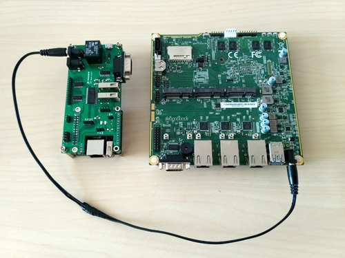

class: center, middle, intro

# Remote Testing Environment Workshop

### OSFC 2018

## Piotr Król, Michał Żygowski


---

# Agenda

* Introduction
* Firmware developer routines
* Remote Testing Environment
* Infrastructure
* Hardware setup
* Automation Tests
* Fixing bugs
* Future plans
    - RTE Control API (beta)
    - New RTE revision for RPi
* Q&A and RTE giveaway

---

# Introduction

.center[
.left-column50[]
.right-column50[]

.left-column50[__Piotr Król__]
.right-column50[__Michał Żygowski__]
.left-column50[_Founder & Embedded Systems Consultant_]
.right-column50[_Firmware Engineer_]
]

.right-column50[
<br/>
-  michal.zygowski@3mdeb.com
- [linkedin.com/in/michał-żygowski-88954416b](https://www.linkedin.com/in/michał-żygowski-88954416b/)
]

.left-column50[
-  @pietrushnic
-  piotr.krol@3mdeb.com
-  [linkedin.com/in/krolpiotr](https://www.linkedin.com/in/krolpiotr)
- [facebook.com/piotr.krol.756859](https://www.facebook.com/piotr.krol.756859)
]

---

# Firmware developer routines

* Narrowing down serious issue requires a lot of repetitive work:
<br/><br/>
    - modify & build firmware with potential fix
    - flash affected firmware version
    - boot system
    - verify if the bug still exists
<br/><br/>
* Problem with automation and remote development

<br/>
To get rid of these problems we created Remote Testing Environment.

---

# Remote Testing Environment

.center[]

---

# Infrastructure

Today, our Devices Under Test are PC Engines APU platforms. For workshop
purposes we will need:

.center[]

Additional infrastructure that can be used is Debian machine with iPXE server
for supplementary boot option.

---

# Hardware setup

* connect RTE Hat with Orange Pi Zero board (~1.5min)

.center[]

---

# Hardware setup

* RS232 interface via a null modem cable (~1min)

.center[]

---

# Hardware setup

* SPI interface via IDC 2x4 pin cable (~1.5min)

.center[.inner[

]]

---

# Hardware setup

* APU PWR/RST pins with RTE OC buffers (~3min)

.left[]

---

# Hardware setup

* DC-DC jack cable (~30s)

.center[]

---

# Hardware setup

.center[]

* take the connected setup to the power/network section (~6min):
    - power up RTE and APU platforms
    - connect Ethernet cable to Orange Pi Zero

---

# Automation tests - RobotFramework

* Generic test automation framework  for acceptance test-driven development
(ATDD)
* Utilizes the keyword-driven testing approach
* The core is implemented using Python and runs also on Jython (JVM) and
IronPython (.NET)

.center[]

---

# Automation tests - test suite structure

Each test suite should contain 4 sections:

```
*** Settings ***
Library           SSHLibrary
Resource          robotframework/variables.robot
Suite Setup       SSH Connection and Log In    ${rte_ip}
Suite Teardown    Log Out And Close Connections

*** Variables ***
${username}       root
${password}       meta-rte

*** Keywords ***
Log Out And Close Connections
    [Documentation]    Close all telnet and ssh open connections.
    Telnet.Close All Connections
    SSHLibrary.Close All Connections

*** Test Cases ***
RTE: 1.1 SSH connection
    ${ssh_info}=    SSHLibrary.Get Connection
    Should Be Equal As Strings    ${ssh_info.host}    ${rte_ip}
```

---

# Automation tests - setup environment

First, prepare the environment:

--

* start Debian RTE Workshop VBox and login
    * password: **`rte-workshop`**

--

* open terminal (Activities/Terminal)

--

* change directory: **`cd RTE-Workshop`**

--

* activate virtualenv: **`source robot-venv/bin/activate`**

.center[]

---

# RTE-Workshop directory tree

.center[]

---

# Connection validation - part 1

Now we should run script which tests our hardware setup:

--

* **`robot -v rte_ip:RTE_IP validation.robot`**

.center[]

where **`RTE_IP`** is your RTE IP address

--

.center[]

---

# Connection validation - part 2

.center[]

---

# Connection validation - part 3

.center[]

---

# Automation tests - logs

* Possible failures:
    * **ssh timeout** - RTE lacks network connection
    * **NoValidConnections** - bad IP address
    * **Telnet timeout** - check RS232 cable or close established connection

--

* After each RobotFramework test suite we can track generated log files:

.left[]

Try it by yourself by typing: **`firefox log.html`**

---

# Flashing firmware - automated process

Flashing process can be started by **`flash-apu.robot`** script:
* **`robot -v rte_ip:RTE_IP -v fw_file:PATH_TO_FILE flash-apu.robot`**

* remember to change **fw_file** firmware path for appropriate APU2/3/4 binary
(if you are not sure, check the sign of life from previous tests)

.center[]

--

Possible failures:
* **opening "/tmp/coreboot.rom" failed** - SSH key not authenticated
* **No such file or directory** - bad firmware file path

---

# Fixing bugs

We have prepared 2 binaries to present the RTE and RobotFramework
capability to track down unexpected bugs and flash APUs firmware:

--

**I. First, let's try to update our DUT with custom firmware:**

--

- run: `robot -v rte_ip:RTE_IP -v fw_file:firmware/apu4_custom.rom flash-apu.robot`

--

.center[]

---

# Fixing bugs

We have prepared 2 binaries to present the RTE and RobotFramework
capability to track down unexpected bugs and flash APUs firmware:

**II. Assumes that we made appropriate changes and build the new binary, flash
APU with the newest v4.8.0.3 firmware:**

--

- run: `robot -v rte_ip:RTE_IP -v fw_file:firmware/apu4_mainline.rom flash-apu.robot`

--

.center[]

---

# Our plans - RTE Control API (beta)

* To open rest API service, type: **`firefox RTE_IP:8000`**

.center[]

---

# Our plans - New revision for RPi

.center[]
.center[New RTE Hat compatible with 40-pin header RaspberryPi 2/3/Zero]

---

# Our plans - New revision for RPi

.center[]
.center[New revision during testing phase]
---

# RTE website & shop

.center[]

---

## .center[Q&A and lottery]

* Cards received at the entrance will serve as numbers to select the winner of the
lottery. **The prizes are three full RTE sets!**

* **Where can I order the RTE for myself?**<br/>
The online store is starting soon, so please submit any orders to:

.center[
 [contact@3mdeb.com](contact@3mdeb.com)

<br/><br/><br/>
Please visit our RTE website: [3mdeb.com/rte](https://3mdeb.com/rte)
]
